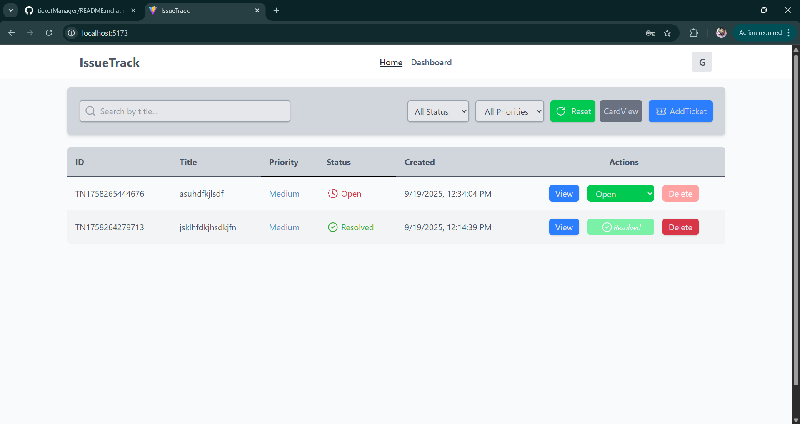

# 🎟 Ticket Management System

A simple, efficient, and responsive **Ticket Management System** built with **React**, **Redux Toolkit**, and **Tailwind CSS**.  
This system helps you **create, track, filter, and manage tickets** with ease.

---------------------------------------

## 🚀 Features

-  **Search Bar** – Quickly find tickets by keywords.  
-  **Filter Options** – Filter by status *(Open, In Progress, Resolved)* and priority *(Low, Medium, High)*.  
-   **View Modes** – Toggle between **Table View** and **Card View**.  
-   **Add Ticket** – Create new tickets easily.  
-   **Delete Confirmation** – Delete tickets safely with a confirmation modal.  
-   **Notifications** – Instant feedback for actions *(delete, update, etc.)*.  
-   **Reset Filters** – Quickly clear all filters and search inputs.  
-   **Session Storage Persistence** – Keeps filters and search state even after page refresh.  

---------------------------------------

## 🛠️ Tech Stack

| Category | Technology |
|-----------|-------------|
| **Frontend** | React 18 |
| **State Management** | Redux Toolkit |
| **Language** | TypeScript |
| **Styling** | Tailwind CSS |
| **Animations** | Framer Motion |

----------------------------------------

## 📸 Screenshots

### 🧾 Ticket Table View
<p align="center">
  
</p>

### 🪪 Ticket Card View
<p align="center">
  
</p>

---------------------------------------

## ⚙️ Installation & Setup

1. **Clone the repository**
   ```bash
   git clone https://github.com/SyntaxByGulshan/ticketManager.git
